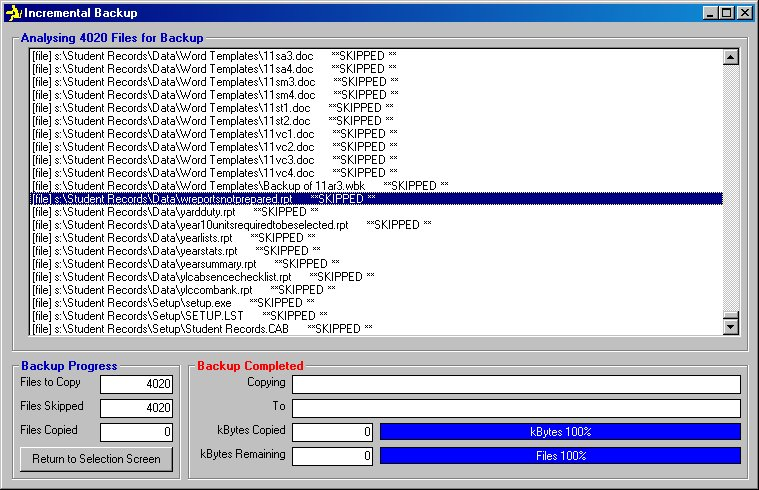



## Incremental Backup

### Description

Backup from a folder and its subfolders to another. The code checks for date last modified and only backs up newer files. This is much quicker than a "copy and paste". Vestigial files will remain in the backup folder and this can be very useful.

Thanks to other PSC contributors including Pietro Cecchi whose .bas module I used.

Experienced users might remove some of the visual feedback features to improve speed. I have also modified a version to remove user input in order to backup a selected folder using Microsoft Scheduler. Hope it is useful.
 
### More Info
 

             |
---                |---
**Submitted On**   |2002-02-17 17:51:56
**By**             |[N/A](https://github.com/Planet-Source-Code/PSCIndex/blob/master/ByAuthor/empty.md)
**Level**          |Intermediate
**User Rating**    |4.9 (44 globes from 9 users)
**Compatibility**  |VB 5\.0, VB 6\.0
**Category**       |[Complete Applications](https://github.com/Planet-Source-Code/PSCIndex/blob/master/ByCategory/complete-applications__1-27.md)
**World**          |[Visual Basic](https://github.com/Planet-Source-Code/PSCIndex/blob/master/ByWorld/visual-basic.md)
**Archive File**   |[Incrementa556942172002\.zip](https://github.com/Planet-Source-Code/incremental-backup__1-31869/archive/master.zip)

